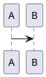

```ditaa {kroki=true}
+--------+   +-------+    +-------+
|        | --+ ditaa +--> |       |
|  Text  |   +-------+    |diagram|
|Document|   |!magic!|    |       |
|     {d}|   |       |    |       |
+---+----+   +-------+    +-------+
    :                         ^
    |       Lots of work      |
    +-------------------------+
```

```kroki-plantuml
@startuml
A -> B
@enduml
```



``` {.python}
def add(x, y):
  return x + y
```

``` {.mermaid}
graph LR
A --> B
```