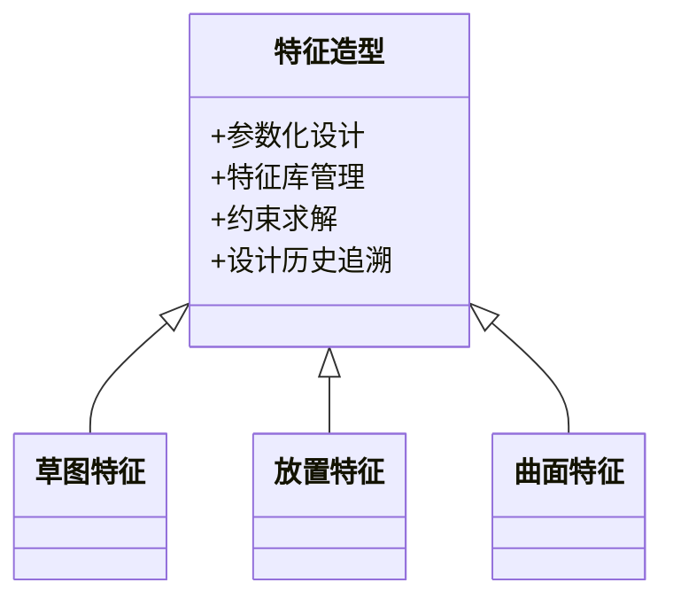

### 有限元法的定义和基本步骤

#### 定义  
有限元法（Finite Element Method, FEM）是一种数值分析技术，通过将复杂工程问题离散为多个简单单元（有限元），建立并求解各单元的数学方程，从而对整体系统的物理行为进行预测和分析。

#### 基本步骤  
1. **离散化（网格划分）**  
   - 将连续的物理域（如结构、流体等）划分为离散的有限元（如三角形、四面体等），每个单元具有明确的节点。
   - 网格密度影响计算精度和效率，需根据问题复杂度调整。

2. **建立单元方程**  
   - 为每个单元推导力学或物理行为的局部方程（如位移、应力、温度等），通常基于平衡方程或能量原理。

3. **整体组装**  
   - 将所有单元方程通过公共节点组装成全局方程组，形成大型稀疏矩阵方程：  
     \[
     [K]\{U\} = \{F\}
     \]
     - \(K\)：刚度矩阵，描述系统刚度特性；  
     \(U\)：位移向量；  
     \(F\)：外部载荷向量。

4. **施加边界条件**  
   - 添加约束条件（如固定边界、位移约束）和载荷条件（如力、温度变化），确保方程组有唯一解。

5. **求解方程组**  
   - 采用数值方法（如迭代法、直接解法）求解线性或非线性方程组，得到节点位移或温度场等结果。

6. **后处理与验证**  
   - 可视化结果（如应力云图、变形图），分析关键区域的力学行为；  
   - 通过实验或理论解验证计算结果的可靠性。

---

### 分析晶粒粗大对变形抗力和塑性的影响

#### 变形抗力的影响  
1. **Hall-Petch关系**  
   - **公式**：  
     \[
     \sigma_s = \sigma_0 + k d^{-1/2}
     \]  
     - \(\sigma_s\)：屈服强度；  
     \(\sigma_0\)：晶内变形阻力（与位错运动相关）；  
     \(k\)：材料常数（与晶界强化能力相关）；  
     \(d\)：平均晶粒尺寸。  
   - **解释**：  
     晶粒尺寸越小，晶界面积越大，位错运动受阻越强，导致屈服强度显著提高。晶粒粗大会降低变形抗力，使材料更易发生塑性变形。

2. **强化机理**  
   - 晶界阻碍位错滑移：晶界处的原子排列紊乱，位错需通过攀移或绕过晶界，增加能量消耗。  
   - 细晶细化增加晶界面积，单位体积内晶界数量更多，进一步阻碍位错运动。

#### 塑性的影响  
- **晶粒粗大的负面影响**：  
  - 晶界减少，位错滑移路径更长，容易形成应变集中，导致局部塑性变形不均匀。  
  - 晶粒内部缺陷（如空位、位错）可能提前引发裂纹，降低塑性。  
- **粗晶材料塑性可能提高的例外情况**：  
  在某些高应变速率或高温条件下，大晶粒可能通过位错滑移主导的均匀变形机制，表现出更高塑性，但这种情况较少见。

#### 工程应用考虑  
- **优化设计**：通过控制晶粒尺寸（如热处理、加工工艺）平衡强度与塑性需求。  
- **失效分析**：晶粒粗大可能导致零件在低应力下脆性断裂，需通过微观结构分析规避。

---

### 焊接应力的产生原因

#### 定义  
焊接应力是焊接过程中因温度梯度、材料相变和收缩不均匀导致的内应力，可能引发变形或裂纹。

#### 主要产生原因  
1. **温度梯度**：  
   - 焊接区域局部高温导致膨胀，而远离焊缝区域仍保持低温，冷却时收缩不均匀，产生热应力。  
2. **相变应力**：  
   - 高温使焊接热影响区（HAZ）发生相变（如奥氏体→铁素体），体积变化引起内应力。  
3. **收缩应力**：  
   - 焊缝金属凝固收缩时，受周围刚性母材约束，形成拉伸应力。  

#### 影响因素  
- **材料属性**：热膨胀系数、弹性模量、屈服强度。  
- **焊接参数**：焊接速度、电流、热输入量。  
- **结构刚性**：母材的约束程度影响应力分布。  

---

### 弯曲回弹的原因及防治措施

#### 回弹原因及影响因素  
1. **回弹机制**：  
   - 弹性变形恢复：塑性变形后，材料释放弹性变形能量，导致形状恢复（回弹）。  
   - 材料特性：杨氏模量高、硬度高、应变硬化能力强的材料回弹更明显。  
2. **影响因素**：  
   - 弯曲半径：半径越大，回弹角越大。  
   - 材料厚度：厚度增加，回弹减小。  
   - 晶粒尺寸：细晶材料因塑性变形均匀，回弹可能降低。  

#### 防治措施  
1. **工艺调整**：  
   - **过弯（Overbending）**：预先多弯曲一定角度，补偿回弹。  
   - **控制应变速率**：降低速度以增加塑性变形比例，减少弹性恢复。  
2. **模具设计**：  
   - 增加压边力，限制材料流动，提高塑性变形程度。  
   - 采用弹性模量匹配的模具材料。  
3. **材料预处理**：  
   - 通过退火或表面处理降低材料硬度，减少回弹。  

---

### 塑性变形缺陷的原因及防治措施

#### 影响塑性变形的原因  
1. **材料因素**：  
   - 晶粒粗大：阻碍位错运动，导致应变集中。  
   - 夹杂物或第二相颗粒：引发应力集中，降低塑性。  
2. **工艺因素**：  
   - 应变速率过高：材料来不及动态回复，变形不均匀。  
   - 温度过低：导致加工硬化加剧，易开裂。  
   - 润滑不足：摩擦增大，局部应力过高。  

#### 防治措施  
1. **材料优化**：  
   - 细化晶粒（如控制冷却速度）。  
   - 减少杂质含量，均匀分布第二相。  
2. **工艺控制**：  
   - 优化变形温度（如热加工温度区间）。  
   - 采用润滑剂降低摩擦，分阶段加工减少应力集中。  
3. **设备改进**：  
   - 设计合理模具，避免尖锐棱角导致应力集中。  

---

### 拉伸变形中的拉裂与皱褶原因及预防

#### 拉裂的原因和部位  
- **原因**：  
  - 局部应力集中（如截面突变处、模具边缘）。  
  - 材料加工硬化严重，无法继续变形。  
- **常见部位**：  
  - 材料头部或尾部，因夹持不均导致局部拉应力过大。  

#### 皱褶的原因和部位  
- **原因**：  
  - 局部区域受压变形（如过大的侧向压力）。  
  - 材料流动不均匀，导致表面层与底层变形差异。  
- **常见部位**：  
  - 弯曲段或截面变化处，因摩擦或模具间隙不当。  

#### 预防措施  
1. **工艺优化**：  
   - 控制拉伸速度和温度，避免过快硬化。  
   - 采用多道次拉伸，逐步均匀变形。  
2. **模具设计**：  
   - 减小模具圆角半径，改善材料流动。  
   - 优化模具间隙，避免过度挤压。  
3. **润滑与监测**：  
   - 使用润滑剂减少摩擦，降低局部应力。  
   - 实时监测应变分布，调整工艺参数。  

---

### CAD特征造型的定义与特点

#### 定义  
CAD特征造型是一种以**特征（Feature）**为基本单元的三维建模方法。特征是具有特定几何形状和设计意图的参数化单元（如孔、凸台、肋板），通过组合、修改特征快速构建复杂模型。

#### 特点  
1. **参数化设计**：  
   - 特征属性（尺寸、位置）可关联参数，修改参数时模型自动更新。  
2. **模块化与重用性**：  
   - 标准特征（如螺纹孔）可重复使用，缩短设计周期。  
3. **设计意图保留**：  
   - 记录特征创建顺序和约束关系，便于后续编辑和版本迭代。  
4. **数据兼容性**：  
   - 支持与有限元分析（FEM）、数控加工（CAM）等软件无缝衔接。  
5. **高效性**：  
   - 相比传统实体建模，特征操作（如删除、插入）更直观，减少冗余计算。  

---

### 3D打印（增材制造）技术

#### 原理  
3D打印通过逐层堆叠材料（如粉末、液态树脂或丝材）构建三维物体。核心步骤包括：  
1. **分层切片**：将三维模型分解为二维薄层。  
2. **逐层成型**：利用热熔、激光烧结、光固化等技术固化材料层。  
3. **层间结合**：通过温度或化学反应实现层间连接。  

#### 应用前景  
1. **复杂结构制造**：  
   - 可制造传统工艺难以加工的拓扑优化结构（如仿生支架、点阵材料）。  
2. **定制化生产**：  
   - 医疗领域（个性化假体、牙科矫正器）、航空航天（轻量化部件）等需求精准匹配。  
3. **快速原型与修复**：  
   - 缩短产品开发周期，实现零件现场修复（如飞机发动机叶片修补）。  
4. **材料创新**：  
   - 开发复合材料（如金属-陶瓷混合材料）以扩展应用领域。  

#### 挑战与局限  
- **材料限制**：目前主要适用于塑料、金属和陶瓷，高性能材料选择有限。  
- **表面粗糙度与精度**：层间结合可能影响表面质量，需后处理。  
- **成本与速度**：大规模生产成本仍高于传统工艺。  

## 先进成型技术：微锻压成形

### 技术原理

- 利用微米级模具（精度±1μm）  
- 超高压成形（压力>1GPa）  
- 晶粒细化至纳米级（<100nm）

### 技术参数

| 指标         | 参数           |
|--------------|----------------|
| 成形精度     | ±0.1μm         |
| 表面粗糙度   | Ra<10nm        |
| 最小特征尺寸 | 5μm            |
| 材料利用率   | >99%           |

### 应用领域

1. **微机电系统**：  
   - 微型齿轮（模数0.01）  
   - 传感器膜片（厚度5μm）

2. **生物医疗**：  
   - 血管支架（丝径50μm）  
   - 微针阵列（高度200μm）

### 发展趋势

- 2025年目标：  
  - 成形速度>100件/分钟  
  - 成本降低至传统工艺的30%
  
---

以上内容结构清晰，涵盖定义、原理、影响因素及工程应用，可作为学习或报告的参考。