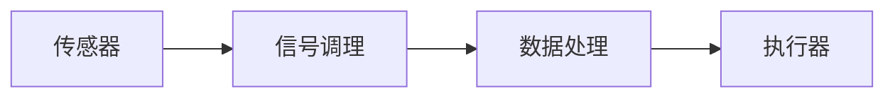

# 2023

## 晶体缺陷类型有哪几种？如何利用和消除？

晶体缺陷主要分为以下几种类型：

### 点缺陷

- 空位缺陷：原子从正常晶格位置缺失
- 间隙原子：原子占据晶格间隙位置
- 替代原子：其他原子替代原有晶格位置

### 线缺陷

- 刃型位错
- 螺型位错
- 混合型位错

### 面缺陷

- 晶界
- 孪晶界
- 堆垛层错

### 体缺陷

- 空洞
- 夹杂物

### 利用方式

1. 提高材料强度（位错强化）
2. 改善半导体性能（掺杂）
3. 控制材料塑性变形

### 消除方法

1. 热处理退火
2. 区域熔炼提纯
3. 添加特定元素
4. 控制生长条件

## 简述晶粒大小对力学性能的影响，如何细化晶粒？

### 晶粒大小的影响

- 强度和硬度：晶粒越细，强度和硬度越高
- 塑性：细晶粒通常具有较好的塑性
- 韧性：适中的晶粒尺寸有利于提高韧性
- 疲劳性能：细晶粒能提高疲劳强度

### Hall-Petch关系

$$ \sigma_y = \sigma_0 + \frac{k}{\sqrt{d}} $$
其中：

- $\sigma_y$：屈服强度
- $ \sigma_0 $：常数（晶内阻力）
- $k$：材料常数
- $d$：平均晶粒直径

### 影响机理

1. 位错运动阻碍
     - **晶界**阻碍位错滑移
     - **应力集中**难以传递

2. 变形协调性
     - 细晶粒提供更多变形单元
     - 应力分布更均匀

3. 裂纹扩展阻力
     - 晶界阻碍裂纹传播
     - 增加断裂能量吸收

### 细化晶粒的方法

1. 热处理方法
    - 正火处理
    - 退火处理
    - 快速冷却
    - 正火处理
        - 加热到奥氏体区（850-900℃）
        - 空冷，冷却速度适中
        - 获得珠光体组织
        - 改善组织均匀性
    
    - 退火处理
        - 完全退火：加热至AC3上30-50℃
        - 缓慢冷却（炉冷）
        - 获得珠光体组织
        - 降低硬度，改善切削性能

    - 淬火处理
        - 加热至奥氏体化温度
        - 快速冷却（水冷、油冷）
        - 形成马氏体组织
2. 机械加工
    - 冷变形
        - 冷轧：室温下板材压延
            - 冷拉：室温下线材拉伸
                - 冷锻：室温下压制成形
    - 热变形
        - 热轧：高温下板材轧制
            - 热锻：高温下自由锻造
                - 热挤压：高温下型材挤压
            - 循环变形

3. 合金化处理
    - 添加细化剂
        - Al合金中加入Ti、B细化晶粒
        - 钢中加入V、Nb、Ti控制奥氏体晶粒长大
    - 合金元素控制
        - 钢中加入Mn提高淬透性
        - Cu合金中加入Sn改善性能
    - 形成第二相粒子
        - Al合金中形成Al3Ti、TiB2析出相
        - 钢中形成碳化物、氮化物细化晶粒

4. 控制凝固条件
    - 提高冷却速度
    - 施加外场（超声、电磁场）
    - 控制结晶核心数量

## 简述含碳量对钢的强度，硬度，塑性的影响

### 含碳量的影响

#### 强度和硬度

- 随碳含量增加而提高
- 碳含量0.8%时达到最大值
- 主要原因是碳化物强化作用

#### 塑性和韧性

- 随碳含量增加而降低
- 延伸率和断面收缩率减小
- 冲击韧性显著下降

### 影响机理

1. 碳化物形成
    - 形成硬质第二相
    - 阻碍位错运动
    - 增强基体强度

2. 组织变化
    - 影响铁素体与珠光体比例
    - 改变晶粒大小和分布
    - 影响相变特性

### 实际应用

- 低碳钢（<0.25%C）：塑性好，易加工
- 中碳钢（0.25-0.6%C）：强度和塑性平衡
- 高碳钢（>0.6%C）：高强度，耐磨性好

## 拉深过程可能存在哪些缺陷，如何防止？

### 常见缺陷

1. ***起皱缺陷***
    - 压边力不足
    - 板料过薄
    - 毛坯尺寸不当

2. 破裂缺陷
    - 压边力过大
    - 润滑不良
    - 材料塑性不足

3. 耳边缺陷
    - 材料异向性
    - 毛坯切割方向不当
    - 压边力分布不均

4. 表面划伤
    - 模具表面粗糙
    - 润滑不足
    - 杂质干扰

### 预防措施

1. 工艺优化
    - 合理选择压边力
    - 优化拉深比
    - 多道次拉深

2. 材料控制
    - 选用适当板材
    - 控制材料方向性
    - 确保材料质量

3. 润滑改善
    - 选择合适润滑剂
    - 保持润滑均匀
    - 定期清理模具

4. 模具维护
    - 定期检查模具
    - 保持表面光洁度
    - 及时修复损伤

## 简述反映系统的组成，以及传感器的选用原则，用ditaa画出组成图

### 反映系统组成

### 主要组成部分

1. 传感器：感知外界信息
2. 信号调理：放大、滤波、转换
3. 数据处理：计算、分析、决策
4. 执行器：执行控制命令

### 传感器选用原则

1. 技术要求
    - 测量范围适当
    - 精度满足需求
    - 响应速度合适

2. 环境适应性
    - 温度范围
    - 防护等级
    - 抗干扰能力

3. 经济性考虑
    - 购置成本
    - 维护费用
    - 使用寿命

4. 可靠性要求
    - 稳定性好
    - 重复性高
    - 故障率低

## 增材,减材,恒材加工的特点及应用领域

### 三种加工方法比较

#### 增材加工

1. 特点
    - 逐层累加成形
    - 材料利用率高
    - 可制造复杂结构
    - 个性化定制方便

2. 应用领域
    - 3D打印技术
        - FDM（熔融沉积）：塑料原型
        - SLA（光固化）：精密模型
        - SLM（选择性激光熔化）：金属零件
    - 焊接堆焊
    - 涂层制备

#### 减材加工

1. 特点
    - 去除多余材料
    - 精度较高
    - 表面质量好
    - 材料损耗大

2. 应用领域
    - 传统机械加工
        - 车削：轴类零件
        - 铣削：型腔加工
        - 磨削：精密表面
    - 特种加工
        - 激光切割
        - 线切割
        - 化学蚀刻

#### 恒材加工

1. 特点
    - 材料体积不变
    - 形状发生改变
    - 生产效率高
    - 批量化生产

2. 应用领域
    - 塑性成形
        - 锻造：曲轴、齿轮
        - 冲压：车身板件
        - 挤压：型材制品
    - 粉末成形
        - 粉末冶金
         陶瓷成形

## 简述沖裁的断面特征,断面特征的产生,断面质量好的标准是什么?或者焊接残余变形的种类及焊后矫正的措施

### 冲裁断面特征

#### 断面特征分区

1. **光滑带(光亮带(质量最佳))**
    - 位于上部
    - 表面光洁平整
    - 由材料弹性变形产生

2. 剪切带
    - 位于中部
    - 呈现剪切痕迹
    - 由塑性变形形成

3. 撕裂带
    - 位于下部
    - 表面粗糙
    - 由材料断裂造成

4. 毛刺
    - 出现在底部边缘
    - 影响零件质量
    - 需要后续处理

### 断面形成机理

1. 弹性变形阶段
    - 材料受压产生弹性变形
    - 形成光滑带

2. 塑性变形阶段
    - 材料开始塑性流动
    - 产生剪切带
3. 断裂阶段
    - 材料承受极限应力
    - 形成撕裂带

### 断面质量标准

1. 光滑带比例
    - 理想状态占30-40%
    - 比例过大表示间隙过大
    - 比例过小表示间隙不足

2. 表面粗糙度
    - 光滑带Ra≤3.2μm
    - 剪切带Ra≤6.3μm
    - 撕裂带Ra≤12.5μm

3. 垂直度
    - 断面垂直度偏差≤0.1mm
    - 避免明显倾斜

4. 毛刺控制
    - 毛刺高度≤0.1mm
    - 边缘整洁无缺口

### 焊接残余变形种类

#### 横向变形

- 垂直于焊缝方向
- 由***横向收缩***引起
- 影响装配精度

#### 纵向变形

- 平行于焊缝方向
- 由***纵向收缩***造成
- 导构件弯曲

#### 角变形

- 焊缝两侧成角度
- 由不均匀收缩产生
- 影响平面度

#### 扭曲变形

- 构件整体扭转
- 由复杂应力造成
- 降低结构稳定性

### 矫正措施

#### 机械矫正

1. 冷矫正
    - 压力矫正
    - 锤击矫正
    - 辊压矫正

2. 热矫正
    - 点热法
    - 楔形加热法
    - 火焰矫正

#### 预防措施

1. 合理设计
    - 优化焊接工艺
    - 控制焊接顺序
    - 使用定位工装
2. 工艺控制
    - 预热处理
    - 控制热输入
    -分段焊接

## 选择适合锉刀和轴的材料(T10,45钢,ZL250,Q235,Cr12WoV,Cr10,T12)说明排号意义及常用领域

### 材料选择

#### 锉刀材料选择

- T10、T12、Cr12WoV 最适合
- 原因：高硬度、耐磨性好、韧性适中

#### 轴材料选择

- 45钢最适合
- 原因：强度适中、加工性能好、成本低

### 材料编号说明

#### 工具钢（T系列）

- T10：含碳1.0%的工具钢
- T12：含碳1.2%的工具钢
- 主要用途：切削工具、模具

#### 合金钢（Cr系列）

- Cr12WoV：12%铬、含钨、钒的高合金工具钢
- Cr10：10%铬合金钢
- 应用：模具、刀具、量具

#### 结构钢

- 45钢：含碳0.45%的中碳钢
- Q235：屈服强度235MPa的普通碳素钢
- 用途：机械零件、建筑结构

#### 铝合金

- ZL250：铸造铝合金
- 应用：铸造件、机械外壳

## 写出两种CAD软件,详细介绍其中一个的主要功能和应用

### 常见CAD软件

1. AutoCAD
2. SolidWorks

### AutoCAD详细介绍

### 开发语言和脚本

1. 主要开发语言
    - C++：核心功能开发
    - .NET Framework：二次开发接口
    - ObjectARX：深度定制开发

2. 脚本语言
    - **AutoLISP**
        - 最常用的脚本语言
        - 简单易学
        - 适合自动化任务
    - VBA
        - Visual Basic for Applications
        - 图形界面开发
        - 数据处理能力强
    - DCL
        - Dialog Control Language
        - 对话框设计
        - 用户界面开发

***3. 宏命令
    - Script脚本***
    - Command脚本
    - Action Recorder录制

#### 主要功能

1. 二维绘图
    - 直线、圆弧、多边形等基本图形
    - 图层管理
    - 标注系统
    - 坐标系统

2. 三维建模
    - 实体建模
    - 曲面建模
    - 网格建模
    - 渲染功能

3. 编辑功能
    - 移动、复制、镜像
    - 修剪、延伸、倒角
    - 阵列、缩放
    - 图块管理

#### 应用领域

1. 建筑设计
    - 建筑平面图
    - 立面图
    - 剖面图
    - 施工图

2. 机械制图
    - 零件图
    - 装配图
    - 工程图纸
    - 模具设计

3. 工业设计
    - 产品设计
    - 工艺布局
    - 管道设计