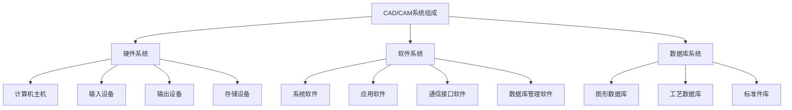

# 什么是加工硬化？原因？对金属的影响

加工硬化（形变强化）是金属在塑性变形过程中，强度和硬度增加而塑性降低的现象。

## 原因

1. 位错密度增加
2. 晶粒细化
3. 内应力增加
4. 织构形成

### 对金属的影响

1. **力学性能变化**
    - 强度和硬度提高
    - 塑性和韧性下降

2. **工艺性能影响**
    - 成形难度增加
    - 加工抗力增大
    - 表面质量降低

3. **使用性能**
    - 疲劳强度提高
    - 耐磨性增强
    - 应力腐蚀敏感性增加

## 金属塑性成形的分类

### 按受力和变形方式分类

1. **压缩变形**
    - 锻造
    - 轧制
    - 挤压
    - **锻造与轧制的区别**
        - 锻造：使用冲击或压力使金属变形，可加工大型工件
        - 轧制：通过旋转的轧辊对金属坯料进行轧压，主要生产板材、型材
        - 挤压：使金属通过一定形状的模孔，制造各种截面形状的长条形材
    - **工艺特点**
        - 锻造：变形不连续，设备简单，适用于单件生产
        - 轧制：连续生产，生产效率高，适用于批量生产
        - 挤压：变形量大，表面质量好，适合复杂截面
2. **拉伸变形**
    - 拉拔
    - 拉深
    3. **拉拔与拉深的区别**
        - 拉拔：将金属棒、管、丝通过模具孔道使其横截面减小、长度增加的加工方法
        - 拉深：将平板坯料加工成空心件的塑性成形方法
        - 主要变形：
            - 拉拔以截面减小为主
            - 拉深以形状改变为主
        - 应用：
            - 拉拔用于制造金属丝、管、棒
            - 拉深用于制造各类容器、箱体
3. **弯曲变形**
    - 弯曲成形
    - 卷曲成形
    - **弯曲成形与卷曲成形的区别**
        - 弯曲成形：
            - 局部变形，形成角度
            - 变形量较小
            - 主要用于制造**角钢、槽钢**等
        - 卷曲成形：
            - 连续变形，形成圆弧形
            - 变形量较大
            - 主要用于制造**圆管、螺旋管**等
        - 工艺特点：
            - 弯曲：设备简单，精度要求低
            - 卷曲：需专用设备，精度要求高
4. **剪切变形**
    - 剪切
    - 冲裁

```ditaa {kroki}
        +-------+
        |       |
        |       |
        |       | 
        +-------+
```

### 按温度特征分类

1. **热加工**
    - 在再结晶温度以上进行
    - 变形抗力小，塑性好
    - 表面质量较差

2. **冷加工**
    - 在再结晶温度以下进行
    - 变形抗力大，精度高
    - 表面质量好

3. **温加工**
    - 在再结晶温度附近进行
    - 综合了冷热加工的优点

## 晶粒大小对金属机械性能的影响

### 基本规律

1. **Hall-Petch关系**
    - 晶粒越细，强度越高
    - 屈服强度与晶粒尺寸的平方根成反比

### 具体影响

1. **强度和硬度**
    - 细晶粒提高强度
    - 细晶粒增加硬度

2. **塑性和韧性**
    - 适中晶粒尺寸最有利
    - 过细或过粗都不利

### 实例说明

1. **低碳钢**
    - 细晶粒钢强度可提高30-40%
    - 冲击韧性同时提高

2. **铝合金**
    - 晶粒细化可提高疲劳强度
    - 改善加工性能

## 金属晶粒细化的工艺方法

### 铸造过程中的晶粒细化

1. **化学细化**（变质处理）
    - 加入晶粒细化剂（如钛、硼、锆等）
    - 形成异质核心促进形核
    - 铸铁中加入Si、Ca

2. **物理细化**（结晶过程）
    - 超声处理
    - 机械振动
    - 电磁搅拌

3. **工艺控制**
    - 提高冷却速度
    - 控制浇注温度
    - 优化浇注系统

### 锻造过程中的晶粒细化

1. **变形控制**
    - 合理的变形量
    - 多向锻造
    - 控制变形速度

2. **温度控制**
    - 适当的锻造温度
    - 分级锻造
    - 控制终锻温度

3. **热处理配合**
    - 正火处理
    - 退火处理
    - 调质处理

### 效果验证

- 金相观察
- 力学性能测试
- 晶粒度测定

## 残余应力的后果及消除方法

### 残余应力的分类

1. **按应力分布范围分类**
    - 第一类（宏观应力）
    - 第二类（微观应力）
    - 第三类（亚微观应力）

2. **按产生原因分类**
    - 热应力
    - 相变应力
    - 变形应力

3. **按应力性质分类**
    - 拉伸残余应力
    - 压缩残余应力
    - 剪切残余应力

#### 按应力分布范围的消除方法

1. **第一类（宏观应力）消除**
    - 退火处理
    - 机械振动时效
    - 自然时效

2. **第二类（微观应力）消除**
    - 低温回火
    - 正火处理
    - 扩散退火

3. **第三类（亚微观应力）消除**
    - 高温退火
    - 固溶处理
    - 再结晶处理

### 残余应力的不利影响

1. **尺寸稳定性问题**
    - 零件变形
    - 尺寸精度降低
    - 加工尺寸不稳定

2. **力学性能影响**
    - 疲劳强度下降
    - 开裂倾向增加
    - 应力腐蚀敏感性提高

3. **使用性能影响**
    - 装配精度降低
    - 振动性能恶化
    - 使用寿命缩短

### 残余应力的消除方法

1. **热处理方法**
    - 低温回火
    - 应力消除退火
    - 时效处理

2. **机械方法**
    - 振动时效
    - 超声处理
    - 机械拉伸或压缩

3. **工艺控制**
    - 对称加工
    - 合理加工顺序
    - 均匀加热冷却

## **涡轮机叶片内部裂纹检测方法**

### 超声波探伤法

1. **工作原理**
    - 利用超声波在金属中传播时的反射和衍射特性
    - 裂纹界面会反射超声波，形成特征回波信号
    - 通过回波信号分析判断裂纹位置和大小

### X射线检测法

1. **工作原理**
    - 利用X射线穿透金属的特性
    - 裂纹处密度不同，吸收X射线量不同
    - 在底片上形成明暗对比度差异图像

### 涡流探伤法

1. **工作原理**
    - 利用交变磁场在导体中产生涡流
    - 裂纹导致涡流分布发生变化
    - 通过检测线圈阻抗变化判断裂纹

## 说明增材，恒材，减材加工的特点，举例说明各自的实际应用领域

### 增材加工

1. **特点**
    - 材料逐层堆积成形
    - 可实现复杂几何形状
    - 材料利用率高
    - 个性化定制方便

2. **工艺**
    - 选择性激光烧结(SLS)
    - 熔融沉积建模(FDM)
    - 立体光固化(SLA)
    - 电子束选区熔化(EBM)

3. **应用领域**
    - 3D打印制造复杂零件
    - 医疗器械和假体制作
    - 模具制造
    - 航空航天零部件

### 恒材加工

1. **特点**
    - 材料质量不变
    - 仅改变材料形状
    - 有加工硬化现象
    - 精度和效率较高

2. **工艺**
    - 轧制
    - 拉伸
    - 挤压
    - 弯曲

3. **应用领域**
    - 金属板材冲压
    - 锻造成形
    - 弯曲成形
    - 拉深加工

### 减材加工

1. **特点**
    - 去除多余材料
    - 精度高，表面质量好
    - 材料利用率低
    - 工艺成熟可靠

2. **工艺**
    - 车削
    - 铣削
    - 磨削
    - 切削

3. **应用领域**
    - 机械零件加工
    - 精密仪器制造
    - 模具加工
    - 表面处理

## 简形件拉深的过程中易产生哪些缺陷？以及如何防止或简述焊接残余变形的分类，并提出焊后矫正焊接残余变形的措施

### 拉深缺陷及防止措施

1. **起皱**
    - 原因：
        - 法兰区压缩应力过大
        - 板料流动不均匀
        - 压边力不适当
    - 防止措施：
        - 增加压边力，使用可调压边力装置
        - 合理选择拉深比和圆角半径
        - 使用压边圈和防皱圈
        - 优化润滑条件
        - 控制拉深速度

2. **开裂**
    - 原因：
        - 变形区拉应力超过材料强度
        - 拉深比过大
        - 材料塑性不足
    - 防止措施：
        - 减小拉深比，采用多次拉深
        - 选用塑性好的材料
        - 增大模具圆角半径
        - 优化压边力
        - 改善润滑条件

3. **耳边**
    - 原因：
        - 材料各向异性
        - 板材轧制方向不一致
        - 晶粒取向不均匀
    - 防止措施：
        - 选用各向同性材料
        - 合理确定毛坯尺寸和形状
        - 优化压边力分布
        - 调整板料取向

4. **橘皮**
    - 原因：
        - 晶粒粗大
        - 变形不均匀
    - 防止措施：
        - 选用细晶粒材料
        - 控制变形均匀性
        - 优化工艺参数

### 焊接残余变形分类与矫正

1. **横向变形**
    - 特征：
        - 垂直于焊缝方向的收缩
        - 造成工件宽度减小
    - 矫正方法：
        - 机械拉伸矫正
        - 点热矫正
        - 预留补偿量

2. **纵向变形**
    - 特征：
        - 平行于焊缝方向的收缩和弯曲
        - 导致工件长度缩短和弯曲
    - 矫正方法：
        - 反向预弯
        - 线热矫正
        - 机械压straightening

3. **角变形**
    - 特征：
        - 焊缝处两板面产生夹角
        - 影响装配精度
    - 矫正方法：
        - 火焰加热矫正
        - 机械压力矫正
        - 预置反向角度

### 焊后矫正综合措施

1. **机械矫正技术**
    - 压力矫正：利用压力使变形部位产生塑性变形
    - 拉伸矫正：通过拉伸使工件恢复平直
    - 冷拔矫正：利用机械力使工件逐步校直
    - 滚压矫正：使用矫正辊对变形处进行矫正

2. **热矫正技术**
    - 点热矫正：局部加热产生塑性变形
    - 线热矫正：沿直线方向加热矫正
    - 楔形加热矫正：通过不均匀加热实现矫正
    - 快速冷却配合：控制冷却速度和方式

3. **预防措施**
    - 合理设计焊接工艺
        - 选择适当的焊接顺序
        - 控制焊接层数
        - 使用背面熔敷
    - 控制热输入
        - 优化焊接参数
        - 采用间歇焊接
        - 控制焊道尺寸
    - 采用对称焊接
        - 对称布置焊缝
        - 平衡焊接顺序
        - 多层多道焊时交替焊接

## 说明CAD/CAM的中文意思；简述CAD/CAM系统的组成部分；说明Auto-CAD、UG 软件、Pro/ENGINEER 软件属于CAD/CAM系统中哪一部分



### CAD/CAM中文意思

1. **CAD (Computer Aided Design)**
    - 计算机辅助设计
    - 利用计算机进行产品设计和绘图

2. **CAM (Computer Aided Manufacturing)**
    - 计算机辅助制造
    - 利用计算机控制和管理制造过程

### 软件分类

1. **Auto-CAD**
    - 属于CAD系统
    - 主要用于二维绘图和基础三维设计

2. **UG软件**
    - 属于CAD/CAM一体化系统
    - 具备设计和制造功能

3. **Pro/ENGINEER软件**
    - 属于CAD/CAM一体化系统
    - 提供完整的产品设计到制造解决方案

## 数值模拟可以用在材料成型领域的产品设计和性能预测，请结合实例介绍如何使用和数值模拟的优势

### 分子动力学模拟在材料成型中的应用

#### 基本原理

1. **模拟方法**
    - 建立原子/分子模型
    - 定义相互作用势函数
    - 求解运动方程
    - 统计分析结果

2. **应用领域**
    - 材料变形机理研究
    - 界面行为分析
    - 缺陷演化预测
    - 新材料性能预测

#### 具体实例

1. **纳米压痕模拟**
    - 材料强度评估
    - 位错形成机制
    - 变形行为分析

2. **界面结构演化**
    - 晶界迁移过程
    - 析出相形成
    - 扩散行为研究

#### 优势特点

1. **微观机理研究**
    - 原子尺度分析
    - 动态演化过程
    - 缺陷形成机制

2. **预测性能**
    - 材料强度预测
    - 热力学性质
    - 相变行为

3. **计算效率**
    - 并行计算
    - GPU加速
    - 多尺度耦合

### 密度泛函理论计算

#### 基本原理

1. **理论基础**
    - 电子密度函数
    - 交换关联泛函
    - 能量最小化原理

2. **计算方法**
    - 平面波基组展开
    - 赝势方法
    - 自洽场迭代

#### 应用实例

1. **材料性质计算**
    - 晶体结构优化
    - 能带结构分析
    - 表面能计算

2. **化学反应研究**
    - 反应路径分析
    - 活化能计算
    - 过渡态搜索

#### 优势特点

1. **高精度预测**
    - 无需实验参数
    - 量子力学基础
    - 可靠性高

2. **成本效益**
    - 减少实验次数
    - 节省研究时间
    - 降低研发成本

### 有限元分析

#### 基本原理

1. **单元划分**
    - 网格生成
    - 单元类型选择
    - 网格质量控制

2. **材料模型**
    - 弹塑性本构关系
    - 硬化规律
    - 失效准则

#### 应用实例

1. **成形工艺优化**
    - 模具设计分析
    - 工艺参数优化
    - 缺陷预测

2. **结构强度分析**
    - 应力分布计算
    - 变形预测
    - 寿命评估

#### 优势特点

1. **工程应用性**
    - 适用范围广
    - 操作相对简单
    - 工程验证充分

2. **可视化分析**
    - 直观展示结果
    - 多场耦合分析
    - 动态过程模拟
