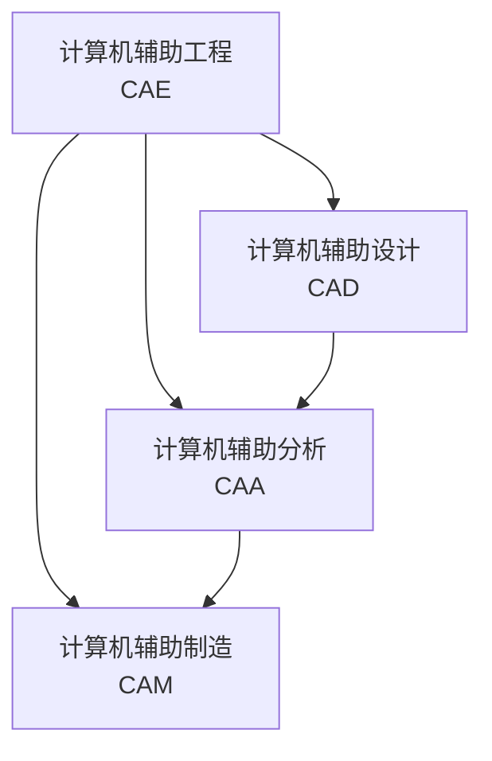

# 内部插件的使用



```ditaa {kroki}
        +-------+
        |       |
        | 12345 |
        |       | 
        +-------+
```

```gnuplot {cmd=true output="html" hide}
set terminal svg enhanced font "SimHei,12"
set title "退火处理温度-时间曲线" font ",14"
set xlabel "时间 (h)"
set ylabel "温度 (℃)"
set grid
set key off
set xrange [0:12]
set yrange [0:1000]

# Define piecewise annealing temperature function
f(x) = x < 2 ? 300 + 300*x : \
       x < 6 ? 900 : \
       900 * exp(-0.2*(x-6))

# Plot the function with proper styling
plot f(x) with lines lw 2 lt rgb "blue" title ""
```
