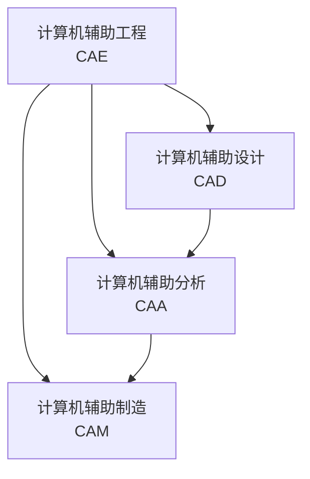

# 专业综合（三）主要考核考生所需掌握的专业知识及应具备的专业技能，

## 金属工艺学

• 材料的性能与工艺性能
• 金属材料铸造工艺基础
• 金属材料塑性加工原理
• 焊接工艺基础
• 金属的切削加工工艺
• 表面工程技术

## 金属材料及热处理

## 加工过程参数测试与控制

## CAD/CAM基础

在机械行业或者自动化行业、计算机辅助设计（Computer Aided Design简称CAD）是利用计算机技术进行设计的过程，也就是我们常说的制图。

计算机辅助制造（Computer Aided Manufacturing简称CAM）是指利用计算机和计算机软件来控制机器进行制造，通常适用于大批量生产的零件。CAD和CAM之间是相辅相成的，它们一般一起使用，用CAD设计，然后利用CAM进行制造加工。

由CAD完成的设计通常需要用另一个程序来进行分析，这个分析过程就是计算机辅助分析（CAA）。

这个分析过程主要是应力分析、载荷分析，在这之后便可以导入到CAM软件中进行下一步工作。CAM、CAD以及CAA都是计算机辅助工程（Computer Aided Engineering CAE）的一部分。

## 材料加工过程数字模拟

## 材料成形与连接技术

@import "2021.md"

@import "2024.md"

@import "2023.md"

@import "CAD.md"

@import "实习.md"

@import "hot-treatment.md"
