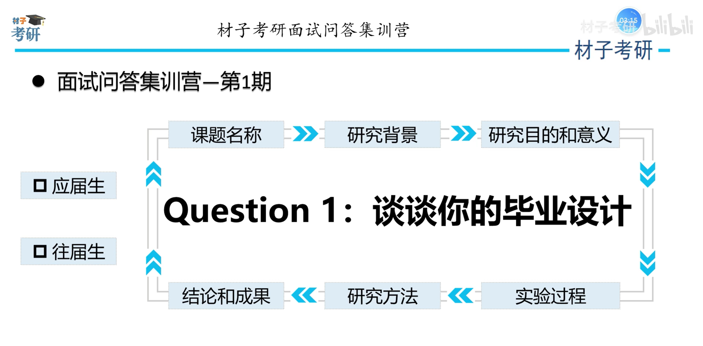
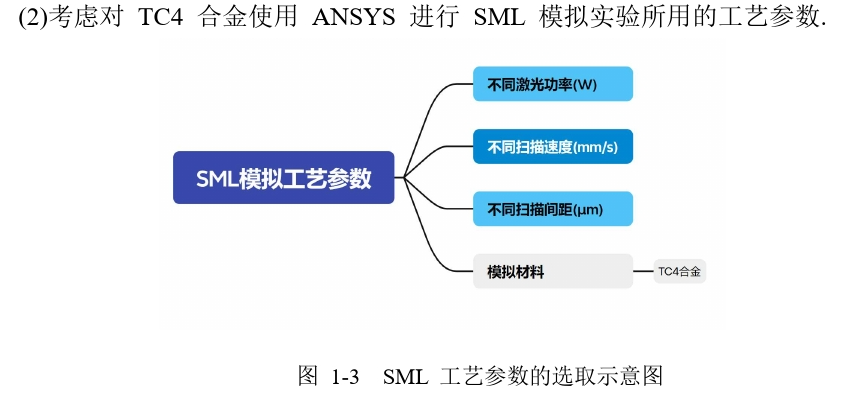

# Day 1

## 目的与意义

### 目的

研究工艺参数(**扫描速度**、**激光功率**和**扫描间距**)对*激光选区熔化*
**TC4 合金**的*合金温度场影响*。

本文对选择性激光熔化成形过程进行**数值模拟**,`研究其温
度场的分布规律`,研究成果将对于

- 选择合适的工艺参数、
- 降低温度梯度,
- 进而对减少实验次数、
- 提高实验成功率。

## 意义

通过试验揭示成形参数的影响不仅耗费了大量时间成本,而且由于快速成形过程
中的复杂性和不确定性,成形过程中的部分现象及缺陷的机理无法被直接揭示。

数值模拟作为试验的**补充和延伸**,可以量化成形参数对成形试样性能的影响,并且可以揭示出 SLM 成形过程中的成形试样的温度场变化。其主要意义体现在使用数值模拟方法,对 TC4 合金的温度场分析并应用于 SLM 成形过程的**预测**和**优化**中[1]。

由所控制的工艺参数,**单个自变量**或**多自变量的不同**排列选择得出多组具有参考价值的数据,可以为实际生产 SLM 成型过程温度
场变化提供有力的参考价值。同时也为生产 TC4 产品的 SLM 多样式具备着指导意义

## 背景

激光选区熔化(`Selective laser melting, SLM`)技术[2] 是激光增材制造技术(`LaserAdditive Manufacturing,LAM`) [3]的一种,由德国亚琛工业大学 Fraunhofer 激光技术
研究所(Fraunhofer-ILT)首先提出并证实了其技术可行性[4]。

**增材制造体系中**最前沿和最具有难度的技术

### 模拟的成形过程为:

- (1)粉料缸上升一定高度,铺粉车将粉料推至成形缸表面并铺均匀,铺粉车再返回原点;

- (2)激光器开始对当前层需成形的区域进行扫描;

- (3)扫描完毕后,成形缸下降一定高度,再进行步骤

## TC4

TC4 合金是一种常见$$α+β$$型钛合金,具有低密度、比强度高、耐腐蚀性能好、耐高温等优良的综合性能,是航空发动机风扇与压气机低温段工作的叶片、盘、机匣等零件的主要材料之一,其长时间服役温度可达 400 °C。

## 优势

- 1 复杂构型的成形。
- 2 制造周期短,成本低。 **SLM 技术在加工完成后,剩余的粉末可以进行回收再利用**
- 3 成形制件性能优异。
- 4 较高的成形精度。`采用了更为精细的金属粉末颗粒(粉末粒径通常在 15~53 μm的范围)和较小的光斑(小于 100 μm),可加工出具有较高尺寸精度和良好表面粗糙度的金属制件,最高成形精度可达±50 μm ,表面粗糙度可达20~30 μm`
